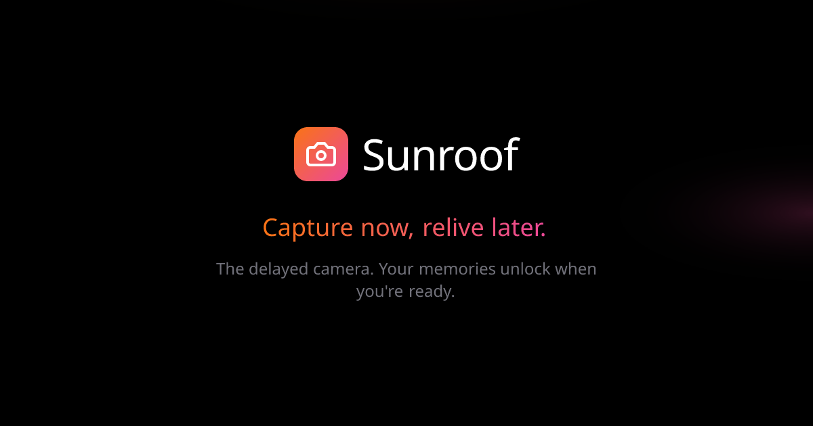

# Sunroof

A "delayed camera" time capsule app for capturing memories during journeys. Photos, notes, and audio stay locked until your journey's unlock date - then you can relive the experience.



## Features

- 📸 **Photo Capture** - Take photos with the native camera or import from gallery
- 🎥 **Video Recording** - Record short video clips
- 🎙️ **Audio Memos** - Record voice memos up to 5 minutes
- 📝 **Text Notes** - Write notes with contextual prompts
- 📍 **Location Context** - Automatically capture location with memories
- 🌤️ **Weather Data** - Save weather conditions with each memory
- 🔒 **Time Capsule** - Memories stay locked until the journey unlock date
- 👥 **Collaboration** - Invite others to contribute memories to shared journeys
- 🤖 **AI Recap** - Generate AI-powered recaps of your journeys
- 🔐 **Secure Auth** - Sign in with Apple, Google, or email magic links via Supabase

## Tech Stack

| Category | Technology |
|----------|------------|
| Framework | React Native 0.81 (bare workflow) |
| Language | TypeScript |
| Backend | Supabase (Auth, Database, Storage, Edge Functions) |
| Auth | Sign in with Apple, Google Sign-in |
| Navigation | React Navigation 7 |
| Camera | react-native-vision-camera |
| Audio | react-native-nitro-sound |
| Video | react-native-video |
| UI | Custom components, react-native-linear-gradient |
| Icons | Lucide React Native |
| Testing | Jest, React Testing Library |
| Linting | ESLint, Prettier, Husky |

## Getting Started

### Prerequisites

- Node.js 18+
- npm
- Xcode 15+ (for iOS)
- Android Studio (for Android)
- CocoaPods (`gem install cocoapods`)

### Installation

1. Clone the repository:

```bash
git clone https://github.com/kseneker/sunroof.git
cd sunroof
```

2. Install dependencies:

```bash
npm install
```

3. Install iOS pods:

```bash
cd ios && pod install && cd ..
```

4. Copy the environment template and add your credentials:

```bash
cp .env.example .env
```

5. Start Metro bundler:

```bash
npm start
```

6. Run on device/simulator:

```bash
# iOS
npm run ios

# Android
npm run android
```

### Running on Physical Device

For iOS devices connected via USB:

```bash
npx react-native run-ios --device
```

## Project Structure

```
src/
├── __tests__/         # Test files
├── components/
│   ├── ui/            # Reusable UI components (Button, Card, Modal, etc.)
│   └── features/      # Feature-specific components
├── constants/         # App constants and theme
├── hooks/             # Custom React hooks
├── lib/               # Utilities (supabase, logger, validation, etc.)
├── providers/         # Context providers (Auth, Toast, Offline)
├── screens/           # Screen components (each in its own folder)
├── services/          # API service layer
└── types/             # TypeScript type definitions
```

## Scripts

| Command | Description |
|---------|-------------|
| `npm start` | Start Metro bundler |
| `npm run ios` | Run on iOS simulator |
| `npm run android` | Run on Android emulator |
| `npm run lint` | Run ESLint |
| `npm run lint:fix` | Run ESLint with auto-fix |
| `npm run format` | Format code with Prettier |
| `npm run typecheck` | Run TypeScript type checking |
| `npm run test` | Run tests |
| `npm run test:coverage` | Run tests with coverage report |
| `npm run clean` | Clean build artifacts and reinstall pods |
| `npm run db:types` | Generate TypeScript types from Supabase schema |

## Environment Variables

Create a `.env` file with the following:

```env
# Required
SUPABASE_URL=your_supabase_project_url
SUPABASE_ANON_KEY=your_supabase_anon_key

# Optional - Google Sign-in
GOOGLE_IOS_CLIENT_ID=your_ios_client_id.apps.googleusercontent.com
GOOGLE_WEB_CLIENT_ID=your_web_client_id.apps.googleusercontent.com

# Optional - Unsplash (for journey cover images)
UNSPLASH_ACCESS_KEY=your_unsplash_access_key
```

## Database Schema

The app uses Supabase with the following main tables:

- **journeys** - User journeys with destinations, emojis, and unlock dates
- **memories** - Photos, videos, notes, and audio attached to journeys
- **profiles** - User profile data
- **journey_collaborators** - Shared journey participants
- **memory_tags** - Tags for organizing memories

## Building for Production

### iOS

```bash
# Debug build
npx react-native run-ios --mode Release

# Archive for App Store
# Open ios/Sunroof.xcworkspace in Xcode
# Product > Archive
```

### Android

```bash
# Debug build
npx react-native run-android --mode release

# Generate signed APK
cd android && ./gradlew assembleRelease
```

## Contributing

1. Fork the repository
2. Create your feature branch (`git checkout -b feature/amazing-feature`)
3. Commit your changes (pre-commit hooks will lint and format)
4. Push to the branch (`git push origin feature/amazing-feature`)
5. Open a Pull Request

## License

MIT License - see LICENSE file for details.
